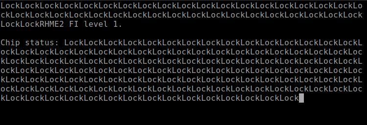
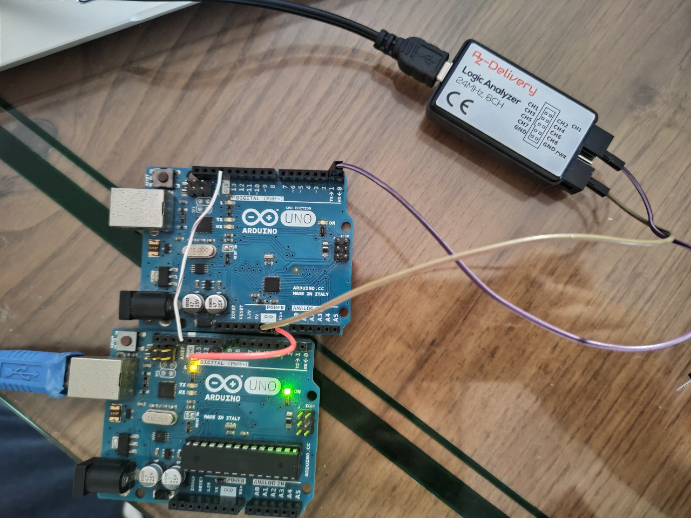
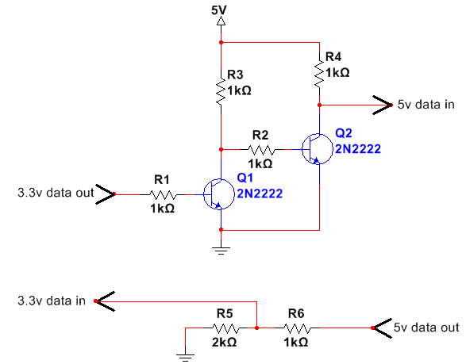
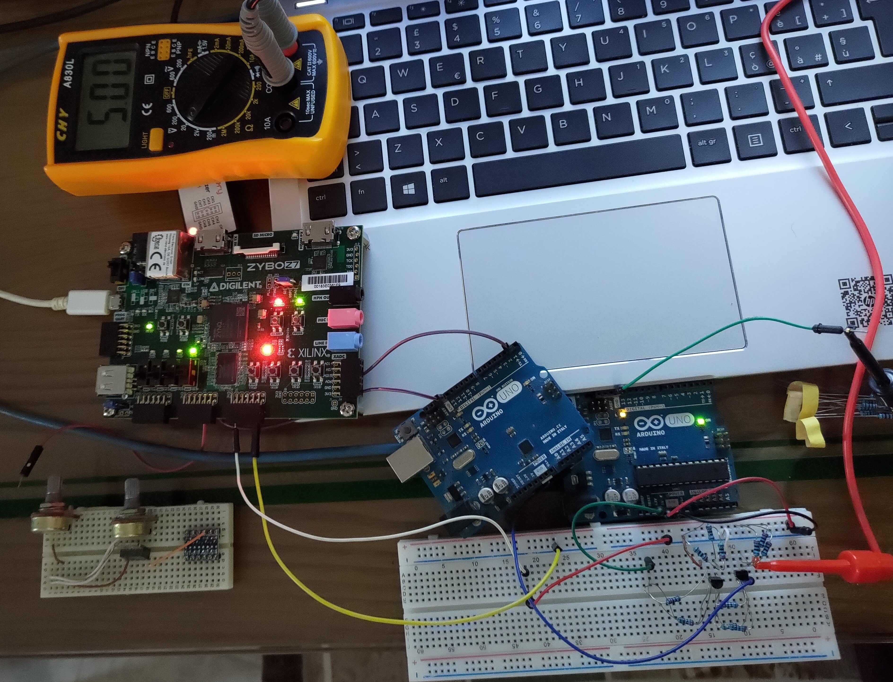
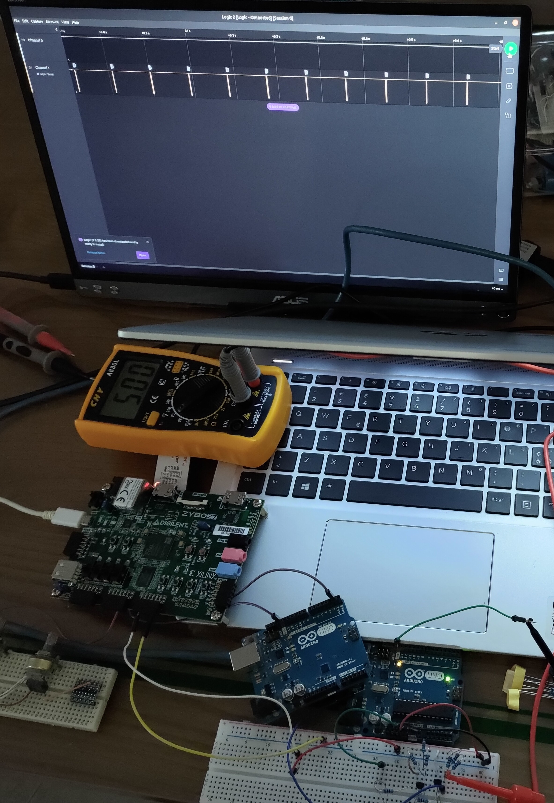

# Fiesta - Fault Injection

Descrizione della challenge:

>Elias Öberson @DrAndroid1337 - Nov 1
>
>Walking around the financial district, >I stumbled upon this strange
>device. Does anybody know what it is?
>
>Elias Öberson @DrAndroid1337 - Nov 1
>
>It does not have any recognisable logos >or marks, only the letters
>"V1" written on one side and a USB >connector on the other. Here is a
>photo.
>
>Elias Öberson @DrAndroid1337 - Nov 1
>
>It probably is some kind of memory, but >it has an unusual design. I
>will check it when I arrive home.
>
>Elias Öberson @DrAndroid1337 - Nov 1
>
>I finally arrived home. I connected the >USB device to my computer, but
>it looks that it is permanently locked.
>
>Elias Öberson @DrAndroid1337 - Nov 1
>
>Now I am curious about the device and >its content. Would I be able to
>unlock it using FI?

Questa Challenge Ha dimostrato limiti tecnici dei nostri mezzi. Abbiamo provato a farne una implementazione ma malgrado anche l'utilizzo di una Zybo z7-10 non siamo riusciti a ricavare la flag anche se veniva richiesta esplicitamente di eseguire una Fault Injection.

Adesso verrà elencato i vari procedimenti che sono stati eseguiti.

Abbiamo caricato il binario della challenge e abbiamo notato che stampava sulla seriale il banner della challenge e dopodiche in 
loop la scitta "LOCK". <br>



Il nostro primo pensiero è che veniva eseguito un blocco di codice, che essendo sempre vera stampava sempre LOCK. Quindi in qualche modo dovevamo far si che quando veniva effetuata il controlllo del while esso veniva saltato.Facendo così magari ci veniva stampato la flag sulla seriale.


Abbiamo quindi pensato di far si che durante l'esecuzione del processo sull'arduino di togliere la tensione dell'Arduino in un istante molto breve per provare a interrompere il funzionamento standard.<br>

Domanda? Come lo facciamo e domanda più importante con quale strumento?

Inizialmente abbiamo considerato di usare un altro arduino e collegare questo alla porta di alimentazione dell'arduino con il binario.
Abbiamo scritto un piccolo script che per un istante davvero minimo esso toglie l'alimentazione. Ecco un snippet che ci consentva di fare tutto ciò in un intervallo da noi scelto.

```c
  if (uiInterval != 0) {
    digitalWrite(pinAttack, LOW);
    delayMicroseconds(uiInterval);
    digitalWrite(pinAttack, HIGH);
    delay(1);
    for(int i = 0; i < 100; i++){
		digitalWrite(pinAttack, LOW);
		delayMicroseconds(1);
		digitalWrite(pinAttack, HIGH);e
		delayMicroseconds(1);
    }
    uiInterval = 0;
    tPrevious = millis();
  }
```



Problema....Non funziona.<br>
abbiamo provato molte volte a farlo eseguire ma purtoppo al massimo riusciamo a farla solo riavviare.
Dopo vari tentativi attraverso il logic analayzer abbiamo studiato il segnale e la transizione da alto->basso a basso->alto avveniva nel ordine dei microscendi, che tecnicamente è troppo per far si che l'arduino abbia abbastanza tensione per rimanare accesso.


Cerchiamo allora una strada differente.
Dato che uno di noi fa Embedded abbiamo utilizzato la zybo z7-10. Ovvero una scheda con un FPGA molto potente data in dotazione per fare l'esame.
Purtroppo è sorto un problema. i Pin della Zybo come tensione d'uscita sono a 3.3v ma la tensione di almientazione è di 5 v.
Allora l'unico modo per far si che si potesse solo utilizzare uno dei pin della scheda è portare la tensione d'uscita a 5v.
Abbiamo realizzato il seguente circuito per poter eseguire questa "trasformazione" della tensione.




con alcuni test abbiamo constatato che il circuito funziona e in qualche modo riusciamo a portare la tensione da 3,3v a 5v grazie all'utilizzo dell'arduino che fa da tensione d'ingresso.



Ottimo ora bisogna simulare quello che abbiamo fatto con l'arduino che eseguiva lo scipt ma implementarlo in vhdl e lo facciamo riutillizando un vecchio divisore di frequenza implementata per l'esame di Asdi

```vhdl
entity divisore_di_frequenza is
		port(   clock: in STD_LOGIC;
				second : out STD_LOGIC
			 );
end divisore_di_frequenza;

architecture Behavioral of divisore_di_frequenza is
	signal clk_1 : STD_LOGIC;
begin

--divisiore di frequenza

div: process (clock)
	variable count : integer := 0;
	begin
		if (clock = '0' and clock ' event ) then
		    if (count <= 19999995) then
		    clk_1 <= '1';
			count := count + 1;
		    else if (count > 19999995 and count < 20000000) then
				clk_1 <= '0';
				count := count + 1;
			else 
				clk_1 <= '0';
				count := 0;
			end if;
		end if;
	end if;
end process ;

second <= clk_1;

end Behavioral;

```

Utillizando poi un file Zybo-z7-10-Master.xdc siamo stati in grado di poter associare il pin second all'uscita 1 dei pin JC che si trovano sulla board.
Realizzato il tutto abbiamo collegato tutto insieme...



Risultato? Non ha funzionato. purtoppo ci sono molti fattori che devono essere messo in gioco crediamo che non riusciamo a raggiungere un intervallo di tempo abbastanza piccolo da poter aggirare il binaro nemmeno per colpa della zybo ma dal fatto che abbiamo usato componenti molto semplici per realizzare il circuito e magari non riescono a reagire all'impulso dell'FPGA come vorremmo.
Un'altra possibilità potrebbe essere quella dell'elevata presenza di condensatori sulla board che probabilmente mantengono la tensione troppo stabile per fare questo tipo di attacchi con il setup che abbiamo.

Infine a causa delle poche possibilità ci siamo fermati e quindi non siamo riusciti a prendere la flag.

Esistono però strumenti adatti per questa ed altre tipologie di attacchi come la "Chip Whisperer" che però non avendo non abbiamo potuto testare.


