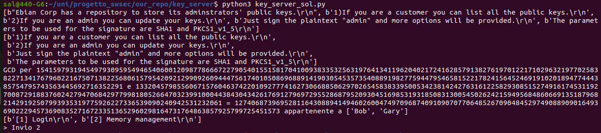
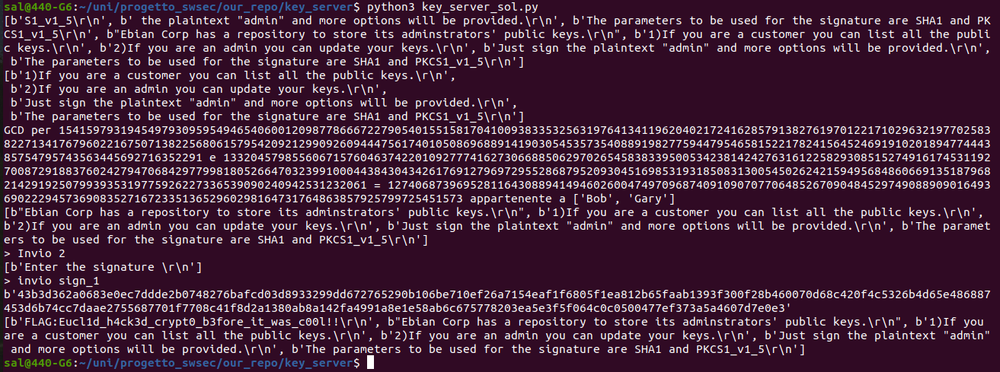

# Key Server - Crypto

Challenge description:

>We have received a portable asymmetric key storage for evaluation purposes.
> This portable device was manufactured by Ebian Corp to
facilitate secure communications with customers.
>
> It generates and stores adminstrators' public keys.
> Customers can use this repository to find the public key of the admin they want to contact, and administrators can use this repository to update their key information.
>
> If this fancy keychain passes the test we are going to
give them away like candy, secure candy.
>
---

When the program starts, the following banner appears on the serial monitor:
```
Ebian Corp has a repository to store its adminstrators' public keys.
1)If you are a customer you can list all the public keys.
2)If you are an admin you can update your keys.
Just sign the plaintext "admin" and more options will be provided.
The parameters to be used for the signature are SHA1 and PKCS1_v1_5
```

From this, we can understand that we are dealing with RSA keys and digital signature algorithms.

By using command `1`, we can view the list of keys stored on the platform.

```
> 1

Public Key List: 
Alice: 
00c90e4c65c0a96080df5aaf73caaf1146afb364cb37894f6bb745182191bf577a2777d8b5dbf57b2ad9f902e2
d3abadfe6ebeb7366d7b11f0cbfd4371dbadf5f548e60644b3365a654b8efe2de32bbb1cc0288d367c0e8cf9ac
8a2544cb067f677c87e82362e3b3ce950d072c5b1baffd650a31db4ff7d7209f0aec0178d7ba8b
Bob: 
00db87e4a4774c4c4606faadeb58460d6c62282aced115ae9d256d6ca2d32b49615c9257869aa0b1757b8faaae
401f94474ddbf5f54b75dfaa7bef370cc9842a920ff9484cabacece44e7c2c80c2c97775a39d035c59475db933
74cbac0d0e4f0830bcc51fe4680ef1d8afce89d61ef7a1fe8f03dd26a7049303f1cbfa94b10323
...
Gary: 
00bdb08ad1d97628b0d4e9bdcdb0303007e66b9d82b3ca3e7df476911f1d0ffd81f67487b4fafc4e252b30c501
055335ab74f1e92e411615b5263d5117daf715740f826a6f8faba2620ddda2852a3595aa9f051d3e0b46766440
360f986cc2db7b7f2d9431e9324280109ac1ed43900a57531ee2878e895c6f5b4ba4311051413d
```

For each user only a single value is stored, but we know that RSA public keys are defined by a pair (n,e).

since `e` is usually a small value, we can assume that the value shown in the list is n and that `n` and that `e` takes a standard value (typically 2^16 + 1, chosen to make exponentiation operations more efficient (square-and-multiply algorithm).

As for the keys, we can assume that among them there are some that share at least one common factor. This is because generating sufficiently large pseudorandom prime numbers is relatively complex for embedded devices, and the same seed may have been used across multiple generations.

This can help us, because both the public and private keys are computed starting from two fairly large randomly generated prime numbers: the product of this pair is exactly `n` and, once `e` is fixed, we can also derive `d` he private-key exponent, from its definition: `d*e = 1 mod(λ(n))` where `λ(n)` s usually computed as `(p-1)*(q-1)`

Once we know the two factors that generated the keys, we can derive a valid private key and use it to sign the plaintex `admin` as stated in the initial banner.

We therefore proceed by calculating the greatest common divisor among all the keys.

```python
...
public_keys = []
while(b'Ebian Corp ' not in a):
    a = s.readline()
    if(b'Ebian Corp ' not in a):
        public_keys.append(a)

lines = s.readlines()
pprint(lines)

cur_name = None
for line in public_keys:
    if b": " in line:
        name = line.decode('utf-8').split(":")[0]
        cur_name = name
        keys[name] = []
    else:
        keys[cur_name].append(line)


for user in keys:
    keys[user] = int(''.join([ k.decode('utf-8').rstrip() for k in keys[user]]),16)

q = None

for pub1, pub2 in combinations(keys.values(), 2):
    massimo_comune_divisore = gcd(pub1,pub2)
    if(massimo_comune_divisore != 1):
        utenti = [k for k,v in keys.items() if v == pub1 or v == pub2]
        print(f"GCD per {pub1} e {pub2} = {massimo_comune_divisore} appartenente a {utenti}")
        q = massimo_comune_divisore

...
```
This way, we find that Bob’s and Gary’s keys share a common factor!



Having noticed this, we can proceed to compute the other factor by dividing `n` by the prime number, and thus obtain all the information needed to generate a valid
private key:
```python

n1 = pub1
p1 = n1//q
phi1 = (p1-1)*(q-1)
d1 = pow(e, -1, phi1)

key_1 = RSA.construct((n1,e,d1,p1,q), consistency_check=True)

message_to_sign = b'admin'
sign_1 = PKCS1_v1_5.new(key_1).sign(SHA1.new(message_to_sign))

s.write(b'2\r')
s.write(b''+binascii.hexlify(sign_1)+b'\r')

```


