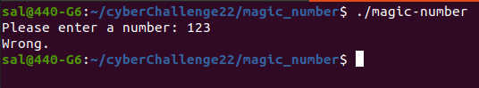
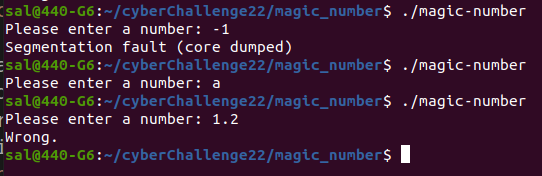
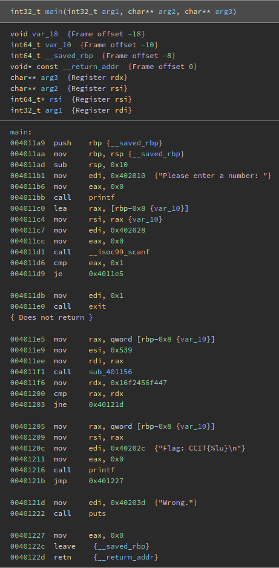
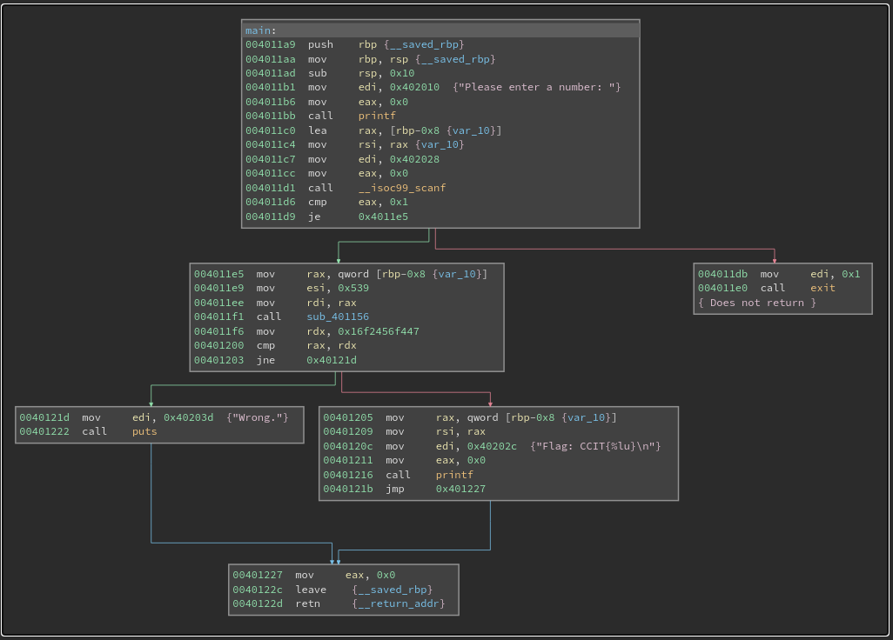
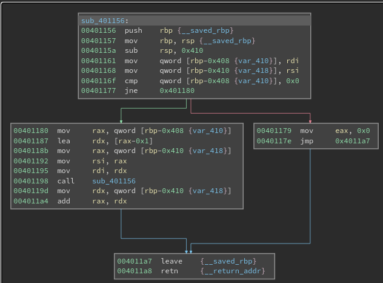
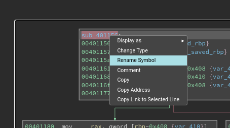
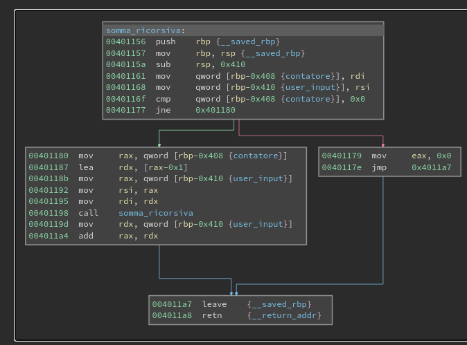
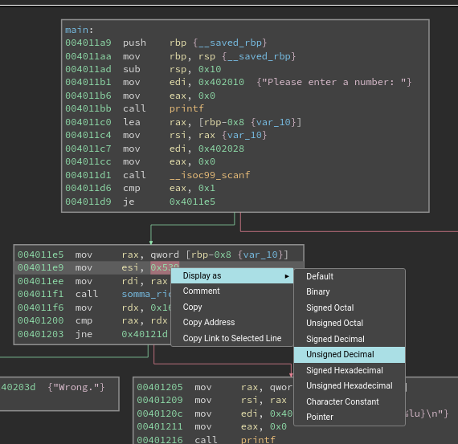
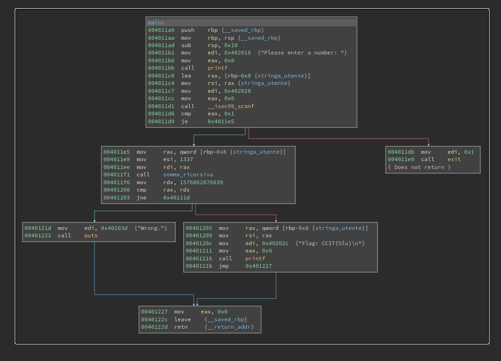
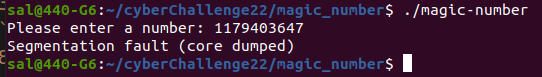

# Magic Number - Rev

Scarichiamo il file allegato alla challenge e lo rendiamo eseguibile con `chmod +x magic-number`

Provando ad eseguirlo, ci chiede di inserire un numero: inserendo un numero a caso restituisce semplicemente `Wrong`

Inserendo invece dei valori palesemente errati (Numeri negativi, decimali o stringhe) abbiamo comportamenti differenti:

A quanto pare il programma si aspetta un numero positivo.

Proseguiamo l'analisi per capirne il funzionamento usando un disassembler, nel nostro caso useremo Binary Ninja Cloud.

Il codice disassemblato della funzione `main` è quello in seguito:

Per semplificare la lettura dei salti, passiamo alla modalità "Albero":

Vediamo che il programma legge una stringa da tastiera, se la lettura è andata a buon fine, chiama la funzione `sub_401156` passando come argomenti la stringa letta e `0x539` (ci troviamo su x64, quindi i primi due argomenti delle funzioni sono rispettivamente nei registri `rdi` e `esi` )

Infine il risultato della funzione viene confrontato con `0x16f2456f447` e se sono uguali, viene stampata la flag con `printf("CCIT{%lu}",stringa_utente)`

Da questo capiamo che la stringa inserita è proprio la flag.

Analizziamo ora la funzione `sub_401156`

Dalla call all'indirizzo `0x401198` possiamo capire che questa è una funzione ricorsiva.

Il corpo della funzione confronta il primo argomento con `0`. Se sono diversi, richiama se stessa con il primo argomento diminuito di 1 e somma al secondo argomento il risultato della funzione ricorsiva con se stesso; altrimenti restituisce `0`

In pratica questa funzione non fa altro che una moltiplicazione tramite somme successive: somma il valore `0x539` tante volte quanto il valore inserito dall'utente.

Possiamo rendere quindi il main più leggibile andando a rinominare i simboli in binary ninja:

Una volta fatto ciò possiamo facilmente capire che il programma prende un intero come input, lo moltiplica per `0x539 = 1337` e lo confronta con `0x16f2456f447 = 1576862676039`

Non serve altro che inserire come valore `1576862676039/1337` ovvero `1179403647`

Questo però ci porta in una situazione di crash:

Ciò avviene perché essendo richiamata la funzione viene chiamata ricorsivamente 1179403647 volte. Ad ogni chiamata viene salvato sullo stack il vecchio base pointer, le nuove variabili locali e l'indirizzo di ritorno.

Essendo questo ripetuto un numero elevato di volte, lo stack cresce fino a sforare l'area di memoria a lui dedicata e quindi andiamo in una situazione di `Segmentation fault`.

Possiamo però sottomettere la flag così come verrebbe formattata dal programma al termine e vedere che viene riconosciuta correttamente: `CCIT{1179403647}`