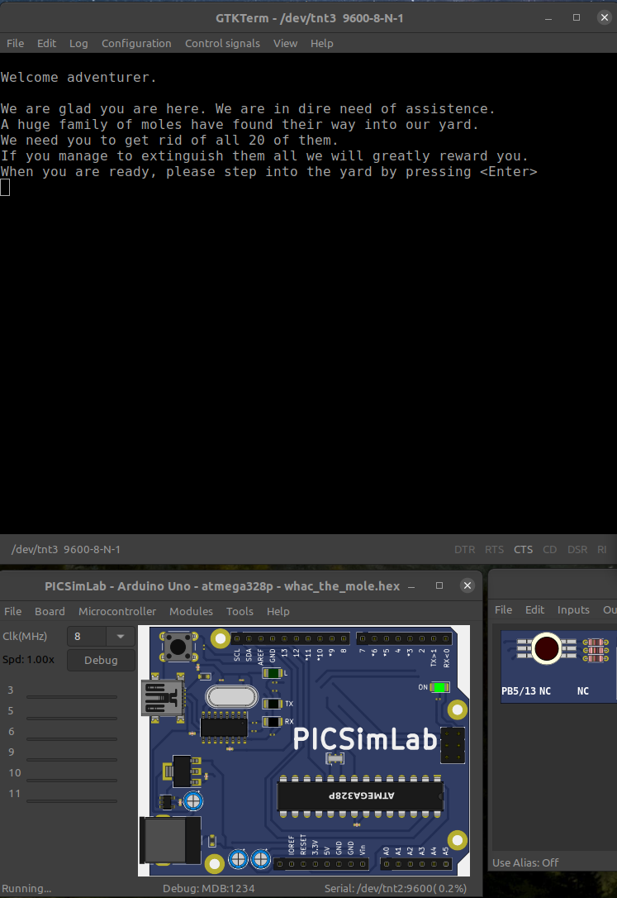
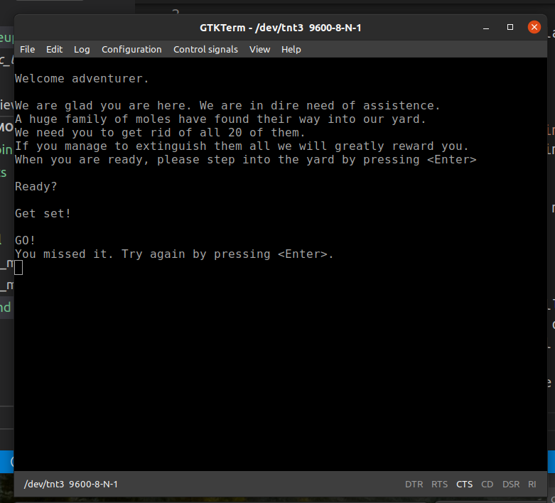
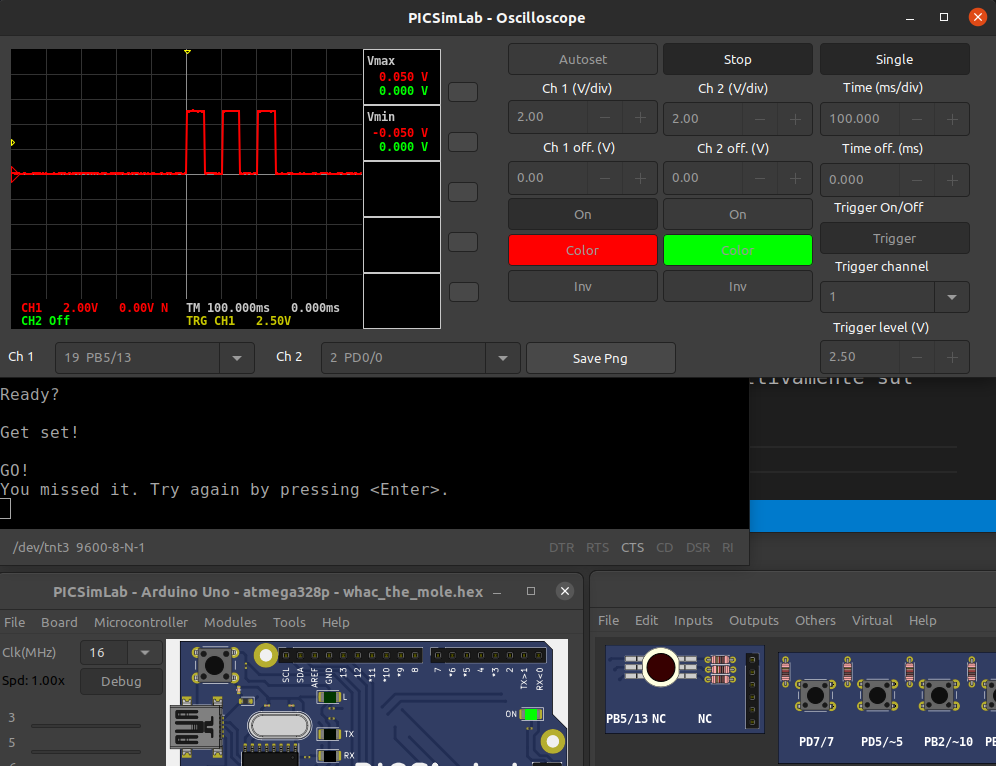
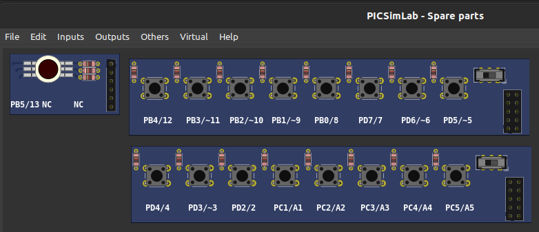
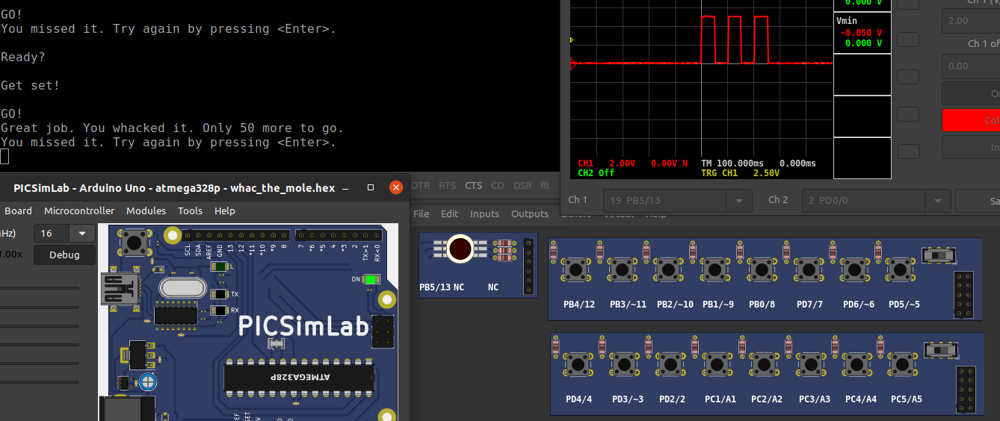
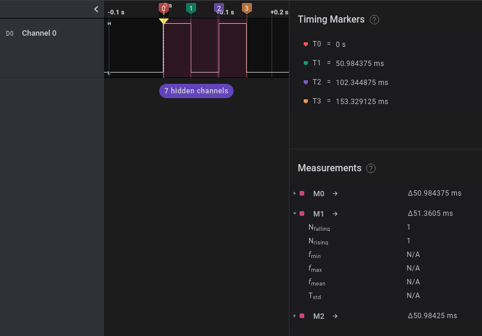
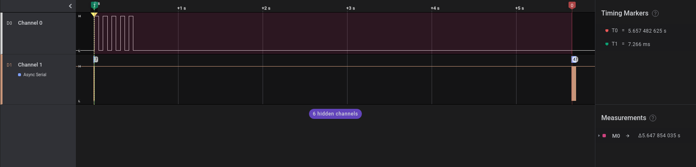
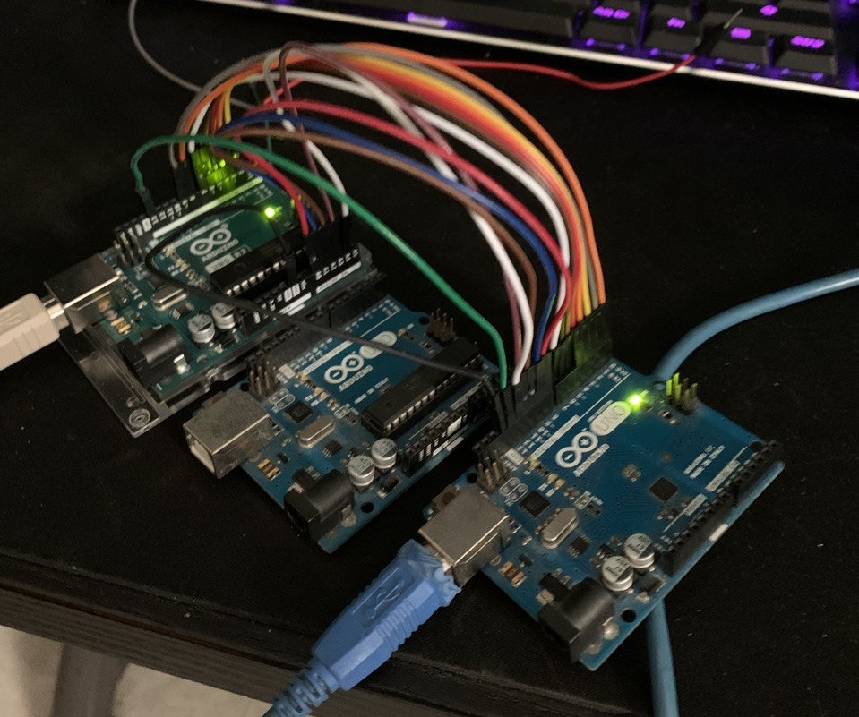
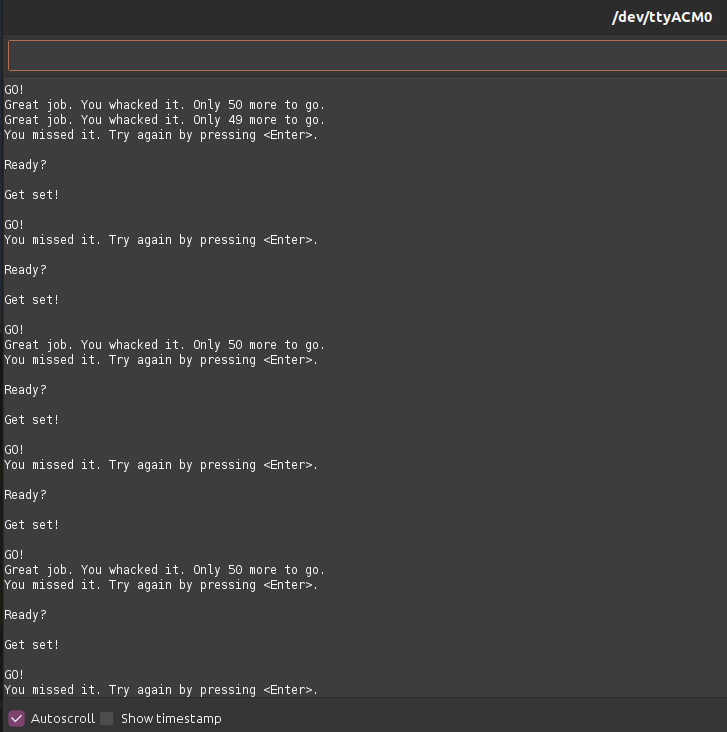
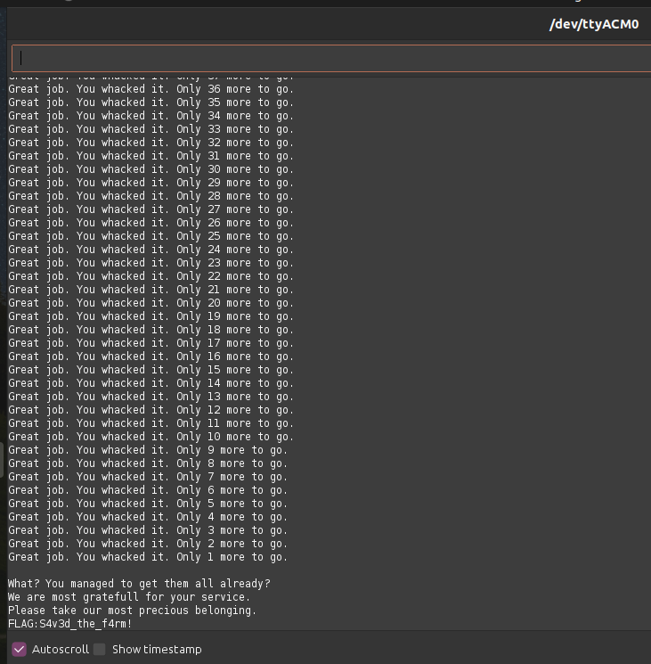

# Whac the mole - Hardware

Descrizione della challenge:

> Who doesn't like a classic game of whac-the-mole?
> 
> This time the moles
infiltrated deep into the backyard of a poor farmer's family. The
moles are ruining the crops, which the farmer desperately needs to
provide for his wife and 2 children.
> 
> Any traveler able to help him by
extinguishing the darn things will be greatly rewarded.
> 
> Are you up for
the task?

Challenge Hardware, realizzata sia simulata che fisicamente

---

Per questa challenge, utilizziamo `PICSimLab`, simulatore basato su `avrsim` per la prima fase di analisi.

All'avvio del programma, si presenta un messaggio sulla seriale:

Una volta premuto invio, non vediamo nulla sul serial monitor: l'unica reazione della board è data dal lampeggiare del led onboard presente sul pin 13

Dopo quello che sembra un timeout, viene mostrato il seguente messaggio:

Possiamo usare lo strumento Oscilloscopio offerto dal simulatore per vedere cosa succede effettivamente sul pin 13:

Possiamo vedere che il led lampeggia 3 volte con un periodo di 100 ms e un duty cycle del 50%

Lanciando più volte il programma vediamo che il numero di impulsi cambia \[1-6\], ma il tempo necessario per il messaggio di errore è sempre di circa 5-6 secondi

Dato il contesto del programma, possiamo ipotizzare che questo sta ad indicare il numero della talpa in movimento da colpire.

Utilizzando gli oggetti Pushbuttons di PICSimLab, possiamo collegarci con la board e provare ad interagire con essa.

Premendo tasti a caso si vede che per alcuni di questi, il messaggio di errore compare prima dei 5 secondi di timeout; inoltre con alcune corrispondenze `numero di impulsi - tasto` viene mostrato un mesasggio che ci fa capire di aver correttamente colpito la talpa.

L'obiettivo quindi è riuscire a definire tutte le 6 coppie `talpa - pin` e completare i 50 colpi necessari per vincere il gioco ed ottenere la flag.

Prima di fare ciò, abbiamo provveduto a replicare le misurazioni fatte anche con un Arduino reale, così da misurare correttamente le tempistiche necessarie per conteggiare gli impulsi. Ciò è stato fatto con `Logic 2` e con un primo sketch di esempio per verificare la corretta interazione dei pin `WTM_Player.ino`

Questo però ci ha portato a notare un paio di cose:
- Ad ogni riavvio vengono riassegnati i pin delle talpe
- Se il codice è in esecuzione per troppo tempo, va in timeout sempre alla 5° - 7° talpa

Una volta risolto il problema dell'assegnazione dei pin e definiti correttamente gli intervalli, abbiamo proseguito con lo scrivere il codice necessario per far si che un altro Arduino possa risolvere la challenge `Sketch_WTM.ino`

